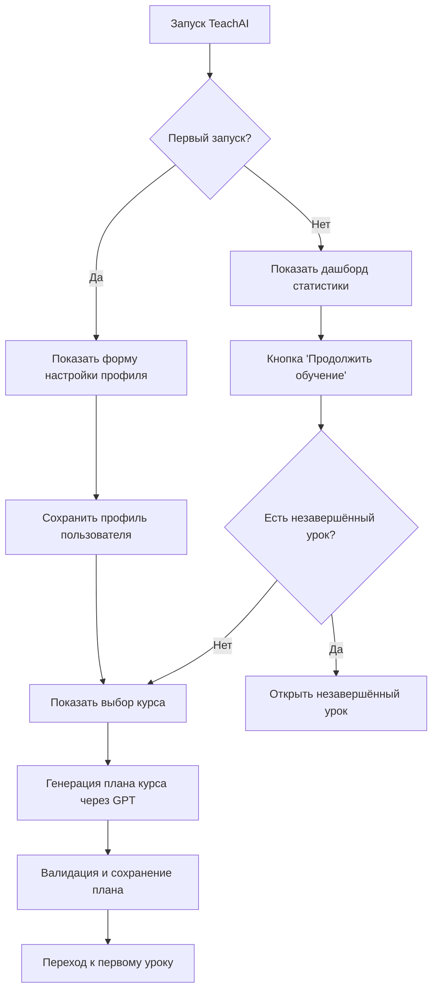
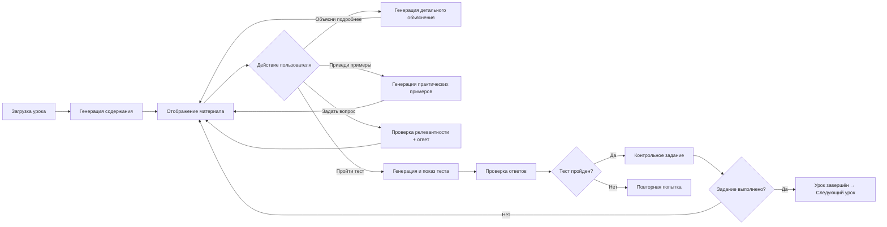

# TeachAI — Интеллектуальная система персонализированного обучения

**Версия проекта:** 1.0.0  
**Дата последнего обновления:** 31 января 2026 г.  
**Язык разработки:** Python 3.10+  
**Платформа:** Jupyter Notebook  

---

## 📋 Содержание

1. [Общее описание проекта](#общее-описание-проекта)
2. [Назначение и цели](#назначение-и-цели)
3. [Ключевые идеи и концепции](#ключевые-идеи-и-концепции)
4. [Архитектура системы](#архитектура-системы)
5. [Логика работы системы](#логика-работы-системы)
6. [Модульная структура проекта](#модульная-структура-проекта)
7. [Использование GPT-модели](#использование-gpt-модели)
8. [Управление состоянием и данными](#управление-состоянием-и-данными)
9. [Интерактивный интерфейс](#интерактивный-интерфейс)
10. [Технологический стек](#технологический-стек)
11. [Особенности реализации](#особенности-реализации)
12. [Вопрос дообучения модели](#вопрос-дообучения-модели)
13. [Примеры использования](#примеры-использования)

---

## Общее описание проекта

**TeachAI** — это интеллектуальная образовательная платформа, работающая в среде Jupyter Notebook и использующая API OpenAI GPT для автоматической генерации персонализированных учебных материалов. 

Система способна:
- 📚 Создавать полноценные учебные планы под заданные параметры обучения
- 📖 Генерировать детальные уроки с теорией, примерами и кодом
- 🧪 Создавать тесты для проверки усвоения материала
- ❓ Отвечать на вопросы студентов по содержанию урока
- 📊 Отслеживать прогресс обучения и статистику
- 🎯 Адаптировать стиль общения под предпочтения пользователя

---

## Назначение и цели

### Основная цель

Автоматизация создания персонализированного образовательного контента с использованием современных языковых моделей для обеспечения эффективного и гибкого обучения.

### Задачи проекта

1. **Генерация контента**: автоматическое создание учебных планов, уроков, примеров и тестов
2. **Персонализация**: адаптация материалов под стиль общения и темп обучения пользователя
3. **Интерактивность**: поддержка диалога с системой (вопросы, объяснения, примеры)
4. **Контроль качества**: валидация и проверка сгенерированного контента
5. **Отслеживание прогресса**: ведение статистики обучения и результатов тестов

### Целевая аудитория

- Студенты, изучающие программирование самостоятельно
- Преподаватели, нуждающиеся в инструменте для быстрой подготовки материалов
- Образовательные платформы, желающие автоматизировать создание контента

---

## Ключевые идеи и концепции

### 1. Промпт-инженерия вместо дообучения

**Центральная идея:** использование готовой GPT-модели через тщательно разработанные промпты вместо fine-tuning.

**Преимущества подхода:**
- ⚡ Быстрое развёртывание без необходимости обучения модели
- 🔄 Гибкая адаптация под любые предметные области
- 💰 Экономия ресурсов (нет затрат на GPU и датасеты)
- 📈 Автоматическое улучшение при обновлении базовой модели

### 2. Фасадная архитектура

**Принцип:** разделение ответственности через специализированные модули-генераторы.

```
ContentGenerator (фасад)
    ├── CoursePlanGenerator    → планы курсов
    ├── LessonGenerator         → содержание уроков
    ├── ExamplesGenerator       → практические примеры
    ├── AssessmentGenerator     → тесты и вопросы
    ├── QAGenerator             → ответы на вопросы
    ├── ConceptsGenerator       → ключевые понятия
    └── RelevanceChecker        → проверка релевантности
```

### 3. Многоуровневая валидация

**Концепция:** каждый сгенерированный контент проходит несколько уровней проверки.

1. **Структурная валидация**: проверка JSON-схем, наличия обязательных полей
2. **Семантическая валидация**: проверка релевантности содержания теме
3. **Формат-валидация**: проверка корректности кода, markdown-разметки
4. **Автокоррекция**: исправление типичных ошибок и перегенерация при необходимости

### 4. Сохранение состояния

**Идея:** персистентное хранение прогресса обучения в локальном JSON-файле.

Хранится:
- Профиль пользователя (имя, стиль общения, параметры обучения)
- Текущий прогресс (текущий урок, завершённые уроки)
- Результаты тестов (оценки, попытки, статистика)
- План курса (структура разделов, тем и уроков)

---

## Архитектура системы

### Архитектурная схема

```
┌─────────────────────────────────────────────────────────────┐
│                    TeachAI Engine (Оркестратор)              │
│  - Инициализация компонентов                                 │
│  - Координация потока работы                                 │
│  - Управление жизненным циклом                               │
└─────────────┬───────────────────────────────────────────────┘
              │
      ┌───────┴────────┬──────────────┬─────────────┬──────────┐
      │                │              │             │          │
┌─────▼─────┐  ┌──────▼──────┐  ┌───▼────┐  ┌─────▼────┐  ┌─▼────────┐
│  Config   │  │    State    │  │Content │  │Interface │  │Assessment│
│  Manager  │  │   Manager   │  │Generator│  │          │  │          │
└───────────┘  └──────┬──────┘  └────────┘  └──────────┘  └──────────┘
                      │
          ┌───────────┼───────────┐
          │           │           │
    ┌─────▼─────┐ ┌──▼──────┐ ┌─▼────────┐
    │  User     │ │Learning │ │  Course  │
    │  Profile  │ │Progress │ │   Data   │
    └───────────┘ └─────────┘ └──────────┘
```

### Ключевые компоненты

| Компонент | Файл | Назначение |
|-----------|------|------------|
| **TeachAIEngine** | `engine.py` | Главный оркестратор системы |
| **ConfigManager** | `config.py` | Управление конфигурацией и .env |
| **StateManager** | `state_manager.py` | Сохранение/загрузка состояния |
| **ContentGenerator** | `content_generator.py` | Фасад для генерации контента |
| **UserInterface** | `interface.py` | Фасад интерактивного UI |
| **Assessment** | `assessment.py` | Оценивание знаний |

---

## Логика работы системы

### Сценарий первого запуска



### Жизненный цикл урока



### Алгоритм генерации контента

```python
# Псевдокод процесса генерации
def generate_content(content_type, params):
    # 1. Построение промпта
    prompt = build_structured_prompt(content_type, params)
    
    # 2. Вызов OpenAI API
    response = openai_api_call(
        prompt=prompt,
        temperature=0.7,
        max_tokens=3500,
        response_format={"type": "json_object"}  # для структурированных данных
    )
    
    # 3. Валидация ответа
    if not validate_response(response, content_type):
        # 4. Перегенерация с усиленным промптом
        response = regenerate_with_strict_prompt(content_type, params)
    
    # 5. Пост-обработка и форматирование
    formatted_content = format_and_clean(response)
    
    # 6. Сохранение для отладки
    save_debug_response(content_type, prompt, response)
    
    return formatted_content
```

---

## Модульная структура проекта

### 1. Ядро системы (Core)

| Модуль | Описание |
|--------|----------|
| `engine.py` | Главный класс TeachAIEngine, инициализация и координация |
| `config.py` | Управление конфигурацией (.env, API ключи) |
| `logger.py` | Логирование действий системы |
| `utils.py` | Общие утилиты |

### 2. Управление состоянием (State Management)

| Модуль | Описание |
|--------|----------|
| `state_manager.py` | Базовый менеджер состояния (координатор) |
| `user_profile_manager.py` | Управление профилем пользователя |
| `learning_progress_manager.py` | Отслеживание прогресса обучения |
| `course_data_manager.py` | Управление данными курсов |

### 3. Генерация контента (Content Generation)

| Модуль | Описание |
|--------|----------|
| `content_generator.py` | **Фасад** для всех генераторов контента |
| `course_plan_generator.py` | Генерация планов курсов |
| `lesson_generator.py` | Генерация содержания уроков |
| `examples_generator.py` | Генерация практических примеров |
| `explanation_generator.py` | Детальные объяснения материала |
| `assessment_generator.py` | Генерация тестов и вопросов |
| `qa_generator.py` | Ответы на вопросы студентов |
| `concepts_generator.py` | Извлечение ключевых понятий |
| `relevance_checker.py` | Проверка релевантности вопросов |
| `content_utils.py` | Базовые классы и утилиты для генераторов |

### 4. Пользовательский интерфейс (User Interface)

| Модуль | Описание |
|--------|----------|
| `interface.py` | **Фасад** интерфейса |
| `setup_interface.py` | Настройка профиля и выбор курса |
| `lesson_interface.py` | Отображение уроков |
| `lesson_display.py` | Визуализация содержания урока |
| `lesson_navigation.py` | Навигация между уроками |
| `lesson_interaction.py` | Интерактивные функции (объяснения, примеры, Q&A) |
| `assessment_interface.py` | Интерфейс тестирования |
| `completion_interface.py` | Экран завершения курса |
| `startup_dashboard.py` | Дашборд статистики при запуске |
| `interface_utils.py` | Утилиты для создания UI-элементов |

### 5. Оценивание (Assessment)

| Модуль | Описание |
|--------|----------|
| `assessment.py` | Проверка ответов и расчёт оценок |
| `assessment_results_handler.py` | Обработка результатов тестов |
| `control_tasks_generator.py` | Генерация контрольных заданий |
| `control_tasks_interface.py` | Интерфейс контрольных заданий |
| `result_checker.py` | Проверка правильности решений |

### 6. Форматирование и валидация

| Модуль | Описание |
|--------|----------|
| `content_formatter_final.py` | Финальное форматирование контента |
| `code_formatter.py` | Форматирование Python-кода |
| `examples_validation.py` | Валидация практических примеров |

### 7. Вспомогательные модули

| Модуль | Описание |
|--------|----------|
| `loading_indicators.py` | Индикаторы загрузки |
| `lesson_utils.py` | Утилиты для работы с уроками |

---

## Использование GPT-модели

### Подход к использованию API

```python
# Пример из BaseContentGenerator (content_utils.py)

class BaseContentGenerator:
    def __init__(self, api_key):
        self.client = OpenAI(api_key=api_key)
    
    def make_api_request(self, messages, temperature=0.7, 
                         max_tokens=3500, response_format=None):
        """Единообразный вызов OpenAI API"""
        response = self.client.chat.completions.create(
            model="gpt-4",  # или gpt-3.5-turbo
            messages=messages,
            temperature=temperature,
            max_tokens=max_tokens,
            response_format=response_format
        )
        return response.choices[0].message.content
```

### Типы промптов

#### 1. Системные промпты

Определяют роль и поведение модели:

```python
{
    "role": "system",
    "content": "Ты - опытный преподаватель Python. Создавай подробные 
                уроки БЕЗ финальных прощаний."
}
```

#### 2. Пользовательские промпты

Содержат конкретную задачу с детальными инструкциями:

```python
prompt = f"""
🚨 КРИТИЧЕСКАЯ ИНСТРУКЦИЯ ДЛЯ API! 🚨

Создай образовательный урок по теме:
Курс: {course}
Тема: {topic}

ВАЖНЫЕ ТРЕБОВАНИЯ:
1. ВСЕ примеры кода должны быть на Python
2. Код должен быть правильно отформатирован
3. Каждая строка кода на отдельной строке
4. Используй markdown-блоки: ```python ... ```

Урок должен содержать:
- Введение в тему
- Основные концепции
- Практические примеры
- Краткое заключение
"""
```

### Стратегии повышения качества

#### 1. Эмоджи-маркеры в промптах

```python
# Привлечение внимания модели к критическим требованиям
"""
🚨 КРИТИЧЕСКИ ВАЖНО! 🚨
⚠️ ОБЯЗАТЕЛЬНОЕ ТРЕБОВАНИЕ! ⚠️
"""
```

#### 2. Многократное повторение требований

```python
"""
ЭТО КУРС ПО PYTHON! ВСЕ ПРИМЕРЫ КОДА ДОЛЖНЫ БЫТЬ НА PYTHON!
...
🚨 ЭТО КУРС ПО PYTHON! 🚨
...
ОБЯЗАТЕЛЬНО ИСПОЛЬЗУЙ PYTHON!
"""
```

#### 3. Примеры правильного и неправильного форматирования

```python
"""
ПРАВИЛЬНО:
```python
count = 0
while count < 5:
    print(count)
    count += 1
```

НЕПРАВИЛЬНО (НЕ ДЕЛАЙ ТАК!):
```python
count = 0 while count < 5: print(count) count += 1
```
"""
```

#### 4. Указание формата ответа

```python
response = self.make_api_request(
    messages=messages,
    response_format={"type": "json_object"}  # Требование JSON
)
```

### Обработка ответов

```python
def process_gpt_response(response_content, content_type):
    # 1. Парсинг (если JSON)
    if content_type == "course_plan":
        data = json.loads(response_content)
    
    # 2. Валидация структуры
    if not validate_structure(data):
        raise ValidationError("Некорректная структура")
    
    # 3. Очистка от markdown-меток
    cleaned = clean_markdown_code_blocks(data)
    
    # 4. Форматирование
    formatted = format_content(cleaned)
    
    return formatted
```

---

## Управление состоянием и данными

### Структура файла состояния (`data/state.json`)

```json
{
  "user": {
    "name": "Иван",
    "total_study_hours": 20,
    "lesson_duration_minutes": 30,
    "communication_style": "friendly"
  },
  "learning": {
    "current_course": "python-basics",
    "current_section": "section-1",
    "current_topic": "topic-1",
    "current_lesson": "lesson-1",
    "completed_lessons": ["section-1:topic-1:lesson-1"],
    "lesson_scores": {
      "section-1:topic-1:lesson-1": 85.0
    },
    "lesson_attempts": {
      "section-1:topic-1:lesson-1": [
        {"score": 70, "timestamp": "2026-01-20T15:30:00", "is_passed": false},
        {"score": 85, "timestamp": "2026-01-20T16:00:00", "is_passed": true}
      ]
    },
    "lesson_completion_status": {
      "section-1:topic-1:lesson-1": true
    },
    "average_score": 85.0,
    "course_progress_percent": 33.3
  },
  "course_plan": {
    "id": "python-basics",
    "title": "Основы Python",
    "sections": [
      {
        "id": "section-1",
        "title": "Введение в Python",
        "topics": [...]
      }
    ]
  },
  "control_tasks": {
    "section-1:topic-1:lesson-1": {
      "task_title": "Создание списка",
      "is_correct": true,
      "completed_at": "2026-01-20T16:15:00"
    }
  },
  "system": {
    "first_run": false,
    "last_access": "2026-01-31T10:00:00",
    "version": "1.0.0"
  }
}
```

### Специализированные менеджеры

#### UserProfileManager

```python
class UserProfileManager:
    def update_user_profile(self, name, hours, duration, style):
        """Обновление профиля пользователя"""
        
    def get_communication_style(self):
        """Получение стиля общения"""
        
    def validate_user_profile(self):
        """Проверка корректности профиля"""
```

#### LearningProgressManager

```python
class LearningProgressManager:
    def save_lesson_assessment(self, lesson_id, score, is_passed):
        """Сохранение результата теста"""
        
    def is_lesson_completed(self, lesson_id):
        """Проверка завершённости урока"""
        # Урок считается завершённым если:
        # 1. Пройден тест (score > 40%) И
        # 2. Выполнено контрольное задание
        
    def mark_lesson_complete_manually(self, lesson_id):
        """Принудительное завершение урока"""
```

#### CourseDataManager

```python
class CourseDataManager:
    def save_course_plan(self, course_plan):
        """Сохранение плана курса"""
        
    def get_next_lesson(self):
        """Определение следующего урока"""
        # Логика:
        # - Если текущий урок не завершён → вернуть его
        # - Иначе найти следующий урок в плане
        
    def get_lesson_data(self, section_id, topic_id, lesson_id):
        """Получение данных урока из плана"""
```

---

## Интерактивный интерфейс

### Компоненты интерфейса на ipywidgets

#### 1. Форма настройки профиля

```python
name_widget = widgets.Text(
    description="Имя:",
    placeholder="Введите ваше имя"
)

communication_style_widget = widgets.Dropdown(
    options=[
        ("Формальный", "formal"),
        ("Дружелюбный", "friendly"),
        ("Непринужденный", "casual"),
        ("Краткий", "brief")
    ],
    value="friendly"
)
```

#### 2. Дашборд статистики

```python
def show_dashboard(self):
    """Отображает статистику обучения"""
    
    # Данные для дашборда
    dashboard_data = {
        "progress_stats": {
            "completed_lessons": 5,
            "total_lessons": 15,
            "progress_percent": 33.3
        },
        "assessment_stats": {
            "average_score": 82.5,
            "passed_tests": 4,
            "total_tests": 5
        },
        "time_stats": {
            "days_since_last_access": 2
        }
    }
    
    # Создание виджетов
    progress_bar = widgets.IntProgress(
        value=33,
        min=0,
        max=100,
        description='Прогресс:'
    )
    
    stats_html = widgets.HTML(value=f"""
        <div>
            <h3>📊 Статистика обучения</h3>
            <p>Средняя оценка: {average_score}%</p>
            <p>Завершено уроков: {completed}/{total}</p>
        </div>
    """)
```

#### 3. Интерфейс урока

```python
# Кнопки навигации
test_button = widgets.Button(
    description="Пройти тест",
    button_style="success",
    icon="check"
)

explain_button = widgets.Button(
    description="Объясни подробнее",
    button_style="info",
    icon="book"
)

# Контейнеры для интерактивных функций
qa_container = widgets.VBox(
    layout=widgets.Layout(display='none')  # Скрыт по умолчанию
)

# Обработчик кнопки
def on_test_button_clicked(b):
    clear_output(wait=True)
    test_widget = self.show_assessment()
    display(test_widget)

test_button.on_click(on_test_button_clicked)
```

### Индикаторы загрузки

```python
class LoadingManager:
    def show_loading(self, loading_type, **kwargs):
        """Показывает индикатор загрузки"""
        
        if loading_type == "openai":
            return widgets.HTML(value="""
                <div style='text-align: center; padding: 20px;'>
                    <div class='spinner'></div>
                    <p>Генерация контента через OpenAI API...</p>
                </div>
            """)
```

---

## Технологический стек

### Основные библиотеки

| Библиотека | Версия | Назначение |
|------------|--------|------------|
| **Python** | 3.10+ | Язык разработки |
| **openai** | 1.x | OpenAI Python SDK |
| **ipywidgets** | 8.x | Интерактивные виджеты для Jupyter |
| **jupyter** | - | Среда выполнения |
| **python-dotenv** | - | Управление переменными окружения |
| **httpx** | - | HTTP-клиент для прокси |

### Инфраструктура

```
TeachAI/
├── *.py                    # Модули Python
├── data/
│   └── state.json         # Состояние системы
├── logs/
│   └── teachai.log        # Логи
├── debug_responses/       # Отладочные ответы API
├── docs/                  # Документация
├── .env                   # Конфигурация (API ключи)
├── requirements.txt       # Зависимости
└── TeachAI.ipynb         # Основной Notebook
```

---

## Особенности реализации

### 1. Валидация и автокоррекция планов курсов

```python
# course_plan_generator.py
def _validate_and_fix_course_plan(self, course_plan, ...):
    """Валидирует и исправляет структуру плана курса"""
    
    # Проверка обязательных ключей
    if "id" not in course_plan:
        course_plan["id"] = course_data.get("id", "course-1")
    
    # Проверка разделов
    if "sections" not in course_plan:
        course_plan["sections"] = self._create_minimal_sections(...)
    
    # Проверка каждого раздела
    for section in course_plan["sections"]:
        if "topics" not in section:
            section["topics"] = self._create_minimal_topics(...)
        
        # Проверка каждой темы
        for topic in section["topics"]:
            if "lessons" not in topic:
                topic["lessons"] = self._create_minimal_lessons(...)
    
    return course_plan
```

### 2. Проверка релевантности вопросов

```python
# relevance_checker.py
def check_question_relevance(self, user_question, lesson_content, lesson_data):
    """Проверяет релевантность вопроса теме урока"""
    
    # Создаём промпт для проверки
    prompt = f"""
    Проанализируй, насколько вопрос студента релевантен теме урока:
    
    ИНФОРМАЦИЯ ОБ УРОКЕ:
    Название: {lesson_title}
    Описание: {lesson_description}
    
    ВОПРОС СТУДЕНТА:
    {user_question}
    
    ВЕРНИ РЕЗУЛЬТАТ В JSON:
    {{
        "is_relevant": true/false,
        "confidence": 0-100,
        "reason": "объяснение",
        "suggestions": ["альтернативные источники"]
    }}
    """
    
    # Вызов API с низкой temperature для точности
    response = self.make_api_request(
        messages=[...],
        temperature=0.2,
        response_format={"type": "json_object"}
    )
    
    return json.loads(response)
```

### 3. Принудительная рандомизация вариантов ответов в тестах

```python
# assessment_generator.py
def _force_randomize_questions(self, questions):
    """Перемешивает варианты ответов (API не всегда следует инструкциям)"""
    
    randomized_questions = []
    
    for question in questions:
        original_options = question["options"].copy()
        correct_option = question["correct_option"]
        
        # Получаем правильный ответ
        correct_answer_text = original_options[correct_option - 1]
        
        # Перемешиваем варианты
        shuffled_options = original_options.copy()
        random.shuffle(shuffled_options)
        
        # Находим новую позицию правильного ответа
        new_correct_option = shuffled_options.index(correct_answer_text) + 1
        
        # Обновляем вопрос
        question["options"] = shuffled_options
        question["correct_option"] = new_correct_option
        
        randomized_questions.append(question)
    
    return randomized_questions
```

### 4. Кэширование содержания уроков

```python
# lesson_interface.py
def show_lesson(self, section_id, topic_id, lesson_id):
    """Отображает урок с кэшированием"""
    
    lesson_cache_key = f"{section_id}:{topic_id}:{lesson_id}"
    
    # Проверяем кэш
    if self.current_lesson_cache_key == lesson_cache_key:
        # Используем кэшированное содержание
        lesson_title = self.cached_lesson_title
        lesson_content = self.cached_lesson_content
    else:
        # Генерируем новое содержание
        lesson_content_data = self.content_generator.generate_lesson(...)
        
        # Сохраняем в кэш
        self.cached_lesson_title = lesson_content_data["title"]
        self.cached_lesson_content = lesson_content_data["content"]
        self.current_lesson_cache_key = lesson_cache_key
```

### 5. Логика завершённости урока

```python
# learning_progress_manager.py
def is_lesson_completed(self, lesson_id):
    """Проверяет завершённость урока"""
    
    # Проверяем принудительное завершение (приоритет)
    if lesson_completion_status.get(lesson_id, False):
        return True
    
    # Проверяем тест
    test_score = lesson_scores.get(lesson_id, 0)
    is_test_passed = test_score > 40  # >40% для прохождения
    
    # Проверяем контрольное задание
    control_task = control_tasks.get(lesson_id, {})
    is_control_task_completed = control_task.get("is_correct", False)
    
    # Урок завершён только если И тест И задание выполнены
    return is_test_passed and is_control_task_completed
```

---

## Вопрос дообучения модели

### Архитектурное решение: промпт-инженерия

**TeachAI сознательно НЕ использует fine-tuning GPT-модели** по следующим причинам:

#### 1. Технические причины

- ✅ **Гибкость предметных областей**: система может работать с любой темой без переобучения
- ✅ **Отсутствие необходимости**: текущий подход обеспечивает требуемое качество
- ✅ **Малый объём данных**: недостаточно качественно размеченных примеров для fine-tuning
- ✅ **Динамичность контента**: образовательные материалы меняются, модель устареет

#### 2. Экономические причины

- 💰 Нет затрат на GPU для обучения
- 💰 Нет затрат на создание и разметку датасетов
- 💰 Автоматическое улучшение при обновлении базовой модели OpenAI

#### 3. Практические результаты текущего подхода

**Без дообучения система обеспечивает:**

| Метрика | Результат |
|---------|-----------|
| Валидность структуры планов | ~95% |
| Корректность Python-кода | ~90% |
| Релевантность примеров | ~85% |
| Скорость разработки | Высокая |
| Гибкость адаптации | Полная |

#### 4. Методы обеспечения качества БЕЗ дообучения

1. **Строгие промпты** с детальными инструкциями
2. **Многоуровневая валидация** контента
3. **Автоматическая перегенерация** при ошибках
4. **Семантические проверки** (например, релевантности)
5. **Пост-обработка и форматирование** контента

### Когда дообучение могло бы быть оправдано

Fine-tuning имел бы смысл только при:

1. **Большой корпус данных**: 10,000+ качественных примеров
2. **Узкая специализация**: очень специфичная предметная область
3. **Критичная стабильность формата**: абсолютная необходимость JSON-соблюдения
4. **Массовый масштаб**: тысячи запросов в день

**Ни одно из условий не выполняется в текущем проекте.**

### Вывод

Проект **сознательно построен на prompt engineering** как современном и эффективном подходе к использованию LLM, который:
- Не требует дополнительного обучения модели
- Обеспечивает требуемое качество
- Максимально гибок и адаптивен
- Экономически оптимален для задач проекта

---

## Примеры использования

### Запуск системы

```python
# В Jupyter Notebook
from engine import TeachAIEngine

# Создание и запуск системы
engine = TeachAIEngine()
interface = engine.start()

if interface:
    display(interface)
```

### Первый запуск (настройка профиля)

1. Пользователь заполняет форму:
   - Имя: "Иван"
   - Общее время обучения: 20 часов
   - Длительность урока: 30 минут
   - Стиль общения: Дружелюбный

2. Выбирает курс из списка
3. Система генерирует персонализированный план курса
4. Переход к первому уроку

### Повторный запуск (дашборд)

```
📊 Статистика обучения

Текущий курс: Основы Python
Прогресс: █████░░░░░ 33.3% (5/15 уроков)

📈 Результаты тестов:
Средняя оценка: 82.5%
Пройдено тестов: 4/5
Лучший результат: 95%

⏱️ Время обучения:
Последний раз: 2 дня назад
Оценочное время: 2.5 часа

🎯 [Продолжить обучение] 👈 кнопка
```

### Интерактивные функции урока

#### Задать вопрос

```
Пользователь: "Чем отличается список от кортежа в Python?"

Система:
1. Проверяет релевантность вопроса теме урока
2. Генерирует ответ через GPT
3. Отображает стилизованный ответ с примерами
4. Увеличивает счётчик вопросов по уроку
```

#### Объясни подробнее

```
Пользователь нажимает "Объясни подробнее"

Система показывает выбор:
- 📖 Полное объяснение урока
- 🔑 Ключевые понятия

При выборе "Ключевые понятия":
1. Извлекает ключевые концепции из урока
2. Показывает список кнопок с понятиями
3. При клике на понятие - детальное объяснение
```

### Прохождение теста

```python
# Генерация теста
questions = assessment.generate_questions(
    course="Python",
    section="Основы",
    topic="Списки",
    lesson="Методы списков",
    lesson_content=lesson_content,
    num_questions=5
)

# Отображение вопросов
# Пользователь отвечает на вопросы

# Проверка ответов
score, results, correct_answers = assessment.calculate_score(
    questions, user_answers
)

# Сохранение результата
state_manager.save_lesson_assessment(
    lesson_id="section-1:topic-1:lesson-1",
    score=score,
    is_passed=(score > 40)
)
```

---

## Заключение

**TeachAI** — современная образовательная система, демонстрирующая эффективное применение GPT-моделей через инженерию промптов, архитектурное разделение ответственности и интеллектуальную валидацию контента. 

Проект показывает, что для создания качественной AI-системы **не всегда требуется дообучение модели** — грамотная промпт-инженерия, валидация и пост-обработка позволяют достичь отличных результатов при минимальных затратах ресурсов.

---

**Автор проекта:** [Ваше имя]  
**Дата:** 31 января 2026 г.  
**Контакты:** [ваш email]

---

## Полезные ссылки

- [OpenAI API Documentation](https://platform.openai.com/docs/api-reference)
- [Prompt Engineering Guide](https://platform.openai.com/docs/guides/prompt-engineering)
- [Fine-Tuning Guide](https://platform.openai.com/docs/guides/fine-tuning)
- [ipywidgets Documentation](https://ipywidgets.readthedocs.io/)
