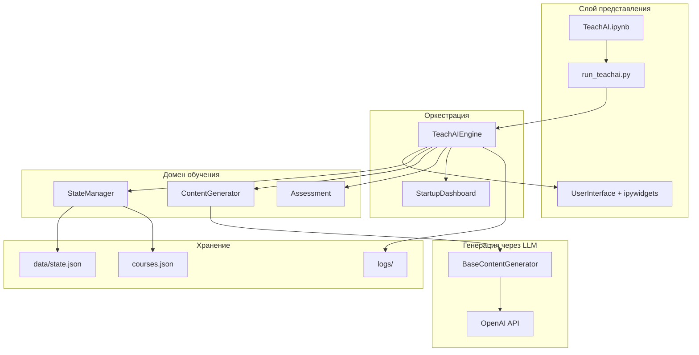

# Описание проекта TeachAI

Документ составлен **по анализу исходного кода** репозитория (май 2026). Устаревшие README/описания не использовались как источник фактов. Всё, что не следует из кода или явных конфигурационных файлов (`courses.json`, `requirements.txt`, `.env.sample`), здесь не утверждается.

---

## 1. Цель и задачи проекта

### 1.1. Цель

Создать **интерактивного AI-учителя** для изучения Python и смежных тем в **Jupyter Notebook**: персонализированный маршрут обучения, автоматическая генерация учебных материалов и проверка усвоения без отдельного веб-сервера и без собственной обучаемой модели.

Цель следует из назначения модулей:

- `engine.py` — «координация всех компонентов системы» TeachAI;
- `lesson_generator.py` — генерация «структурированных образовательных материалов»;
- `content_generator.py` — фасад генерации «уроков, вопросов и обработки ответов пользователя» через OpenAI;
- `interface.py` — «взаимодействие с пользователем через Jupyter Notebook».

### 1.2. Задачи (реализованные в коде)

| Задача | Реализация |
|--------|------------|
| Профиль обучающегося | `SetupInterface`, `UserProfileManager` — имя, часы обучения, длительность урока, стиль общения |
| Выбор курса из каталога | `courses.json`, `CourseDataManager.get_all_courses()` |
| Построение учебного плана под время пользователя | `CoursePlanGenerator.generate_course_plan()` → сохранение в `state["course_plan"]` |
| Генерация содержания урока | `LessonGenerator` + `ContentFormatterFinal` |
| Интерактив на уроке: вопросы, примеры, объяснения, понятия | `LessonInteraction`, `QAGenerator`, `ExamplesGenerator`, `ExplanationGenerator`, `ConceptsGenerator` |
| Фильтрация вопросов по теме урока | `RelevanceChecker` |
| Тестирование после урока | `Assessment`, `AssessmentGenerator`, `AssessmentInterface` |
| Практика с проверкой кода | `ControlTasksGenerator`, `ControlTasksInterface`, `InteractiveCellWidget`, `ResultChecker` |
| Учёт прогресса и возврат к незавершённому уроку | `LearningProgressManager`, `StartupDashboard`, `CourseDataManager.get_next_lesson()` |
| Логирование действий | `Logger` → `logs/` |
| Локальное хранение состояния | `StateManager` → `data/state.json` |

Задачи, **не** реализованные в текущем коде (для ясности границ проекта):

- дообучение / fine-tuning модели;
- централизованный сервер приложений (только клиент в notebook + API OpenAI);
- парсинг внешних учебников как основной источник контента (контент генерируется LLM по метаданным курса и плану).

---

## 2. Стек технологий

### 2.1. Язык и среда выполнения

- **Python 3**
- **Jupyter Notebook** (`TeachAI.ipynb`, зависимости `jupyter`, `ipykernel`, `ipython`)
- **IPython.display** и **ipywidgets** — UI в notebook

### 2.2. Искусственный интеллект

- **OpenAI API** (`openai>=1.95.1`) — чат-модель через `client.chat.completions.create` (`BaseContentGenerator.make_api_request`)
- Модель по умолчанию: **`gpt-4o-mini`** (`os.getenv("LLM_MODEL", "gpt-4o-mini")` в `content_utils.py`)
- Для части валидации контрольных заданий: **`VALIDATION_MODEL`** (fallback на `LLM_MODEL`, `control_tasks_generator.py`)
- Транспорт: **httpx** с прокси (`OPENAI_PROXY` / `HTTPS_PROXY` / `HTTP_PROXY`) — **обязателен** (`config.py`, `BaseContentGenerator.__init__`)

### 2.3. Конфигурация и данные

- **python-dotenv** — `.env`
- **JSON** — `courses.json`, `data/state.json`, логи в `logs/*.json`

### 2.4. Отображение контента

- **markdown**, **pygments** — разметка и подсветка
- **latex2mathml** — формулы в HTML для виджетов (`content_renderer.py`)
- Собственные модули: `content_formatter_final.py`, `content_renderer.py`, `code_formatter.py`

### 2.5. Предметные библиотеки (для примеров и контрольных заданий)

По `requirements.txt`, сгруппировано по курсам:

- Анализ данных: pandas, numpy, matplotlib, seaborn, scipy, openpyxl
- ML: scikit-learn, tensorflow
- Веб: flask, requests
- Финансы: yfinance

Они не требуются для импорта `engine.py`, но нужны при **выполнении** сгенерированного студентом кода в kernel.

### 2.6. Инфраструктура разработки

- `.pre-commit-config.yaml` — хуки качества (в runtime обучения не участвует)
- Каталог `archive/` — старые notebook и презентации, **не** подключаются `run_teachai.py`

---

## 3. Общая архитектура

### 3.1. Слои системы


```mermaid
flowchart TB
    subgraph presentation [Слой представления]
        NB[TeachAI.ipynb]
        RT[run_teachai.py]
        UI[UserInterface + ipywidgets]
    end

    subgraph orchestration [Оркестрация]
        ENG[TeachAIEngine]
        DASH[StartupDashboard]
    end

    subgraph domain [Домен обучения]
        SM[StateManager]
        CG[ContentGenerator]
        AS[Assessment]
    end

    subgraph ai [Генерация через LLM]
        BCG[BaseContentGenerator]
        OAI[OpenAI API]
    end

    subgraph persistence [Хранение]
        STATE[data/state.json]
        LOGS[logs/]
        COURSES[courses.json]
    end

    NB --> RT
    RT --> ENG
    ENG --> UI
    ENG --> SM
    ENG --> CG
    ENG --> AS
    ENG --> DASH
    CG --> BCG
    BCG --> OAI
    SM --> STATE
    SM --> COURSES
    ENG --> LOGS
```

### 3.2. Главные компоненты

| Компонент | Файл | Роль |
|-----------|------|------|
| Точка входа | `run_teachai.py` | `start_jupyter()`, `main()`, опциональный `reload_project_modules()` |
| Движок | `engine.py` | `TeachAIEngine`: init, start, shutdown, проверка урока |
| Конфигурация | `config.py` | `.env`, API-ключ, прокси, каталоги `logs/`, `data/` |
| Состояние | `state_manager.py` | Фасад над профилем, прогрессом, планом курса, кэшем уроков |
| Генерация | `content_generator.py` | Фасад над 8+ генераторами |
| Оценивание | `assessment.py` | Тесты, проверка ответов, связь с логгером |
| UI-фасад | `interface.py` | Маршрутизация экранов |
| Дашборд | `startup_dashboard.py` | Статистика при повторном запуске |
| Системный лог | `logger.py` | История уроков, вопросов, тестов, активности |

### 3.3. Специализация StateManager

`StateManager` делегирует:

- **UserProfileManager** — `state["user"]`
- **LearningProgressManager** — `state["learning"]`, завершённость уроков, оценки, счётчик вопросов
- **CourseDataManager** — `state["course_plan"]`, чтение `courses.json`, навигация `get_next_lesson()`

Дополнительные секции в `state.json` (создаются по мере работы):

- `lesson_content_cache` — HTML и `raw_content` уроков
- `control_tasks` — результаты контрольных заданий
- `system` — `first_run`, `last_access`, `version` (по умолчанию `"1.0.0"`)

### 3.4. Специализация UserInterface

Состояния интерфейса (`InterfaceState` в `interface_utils.py`):

`INITIAL_SETUP` → `COURSE_SELECTION` → `LESSON_VIEW` → (`ASSESSMENT` | `QUESTION_ANSWER` | …) → `COURSE_COMPLETION`

Реализации экранов:

- `SetupInterface` — профиль и выбор курса + вызов генерации плана
- `LessonInterface` — урок (делегаты: `LessonDisplay`, `LessonNavigation`, `LessonInteraction`)
- `AssessmentInterface` — тест
- `CompletionInterface` — завершение курса

### 3.5. Специализация ContentGenerator

| Генератор | Назначение |
|-----------|------------|
| `CoursePlanGenerator` | JSON-план: sections → topics → lessons |
| `LessonGenerator` | Текст урока (markdown) → HTML |
| `ExamplesGenerator` | Практические примеры (данные + HTML) |
| `ExplanationGenerator` | Расширенное объяснение |
| `ConceptsGenerator` | Ключевые понятия и объяснение понятия |
| `QAGenerator` | Ответ на вопрос по уроку |
| `AssessmentGenerator` | Вопросы теста |
| `RelevanceChecker` | Релевантность вопроса, предупреждения |

Общая база: **`BaseContentGenerator`** — клиент OpenAI, retry, очистка HTML урока для промптов, отладочные дампы в `debug_responses/`.

---

## 4. Pipeline AI-учителя: от запуска до ответа

### 4.1. Запуск системы

1. Пользователь выполняет ячейку в `TeachAI.ipynb`: `from run_teachai import start_jupyter; start_jupyter()`.
2. `load_dotenv(override=True)` загружает `.env`.
3. Создаётся `TeachAIEngine()`.
4. `engine.start()`:
   - **Повторный запуск** (`state["system"]["first_run"] == false`): быстрая проверка `.env` и `StateManager`, показ `StartupDashboard` с кнопкой «Продолжить обучение»; полная инициализация (`ContentGenerator`, `Assessment`, `UserInterface`) — **по клику** (ленивая загрузка, `startup_dashboard.py`).
   - **Первый запуск**: `initialize()` → `UserInterface.show_initial_setup()`.

### 4.2. Первичная настройка и план курса

1. `SetupInterface.show_initial_setup()` — форма: имя, часы обучения (1–100), длительность урока (5–120 мин), стиль (`formal` | `friendly` | `casual` | `brief`).
2. Сохранение в `state["user"]`, `reset_learning_and_course_data()`, `first_run = false`.
3. `show_course_selection()` — список из `courses.json`.
4. При подтверждении курса: `ContentGenerator.generate_course_plan(course_data, total_study_hours, lesson_duration_minutes)`:
   - промпт методиста → OpenAI с `response_format: json_object`;
   - валидация/нормализация `_validate_and_fix_course_plan`;
   - `save_course_plan()` в state.
5. Переход к первому уроку через навигацию (`get_next_lesson` / обработчики в `setup_interface`).

### 4.3. Показ урока

Цепочка в `LessonDisplay.show_lesson(section_id, topic_id, lesson_id)`:

1. Ключ кэша: `"{section_id}:{topic_id}:{lesson_id}"`.
2. Загрузка метаданных урока из `course_plan`.
3. **Кэш** (в порядке приоритета):
   - `state["lesson_content_cache"]` (постоянный);
   - in-memory кэш `LessonInterface`;
   - иначе **`LessonGenerator.generate_lesson(...)`**:
     - system: «опытный преподаватель Python»;
     - user: промпт с курсом/разделом/темой/уроком, стилем, требованиями к markdown и блокам ```python;
     - `make_api_request(temperature=0.7, max_tokens=3500)`;
     - `ContentFormatterFinal.format_lesson_content()` → HTML;
     - сохранение `content` + `raw_content` (сырой ответ LLM до CSS).
4. `update_learning_progress()` — текущая позиция в курсе.
5. `Logger.log_lesson()` — запись в `logs/lesson_history.md`.
6. Сборка виджетов: HTML урока (`enhance_content` при необходимости), кнопки («Пройти тест», «Задать вопрос», «Объясни подробнее», «Приведи примеры», контрольное задание), навигация.

**Примечание из кода:** автоматическая вставка интерактивных ячеек через `cell_integration` в `lesson_display.py` **отключена** (`CELLS_INTEGRATION_AVAILABLE = False`). Контрольные задания показываются через `ControlTasksInterface`.

### 4.4. Вопрос пользователя (Q&A)

Обработчик в `LessonInteraction.setup_enhanced_qa_container`:

1. Ввод текста → `increment_questions_count(lesson_full_id)`.
2. `check_question_relevance(question, lesson_content, lesson_data, course_context, lesson_raw_content)`:
   - подготовка текста: срез breadcrumb-заголовков, удаление style/script, лимит символов (`prepare_lesson_text_for_analysis`);
   - запрос к LLM → JSON: `is_relevant`, `confidence`, `reason`, `suggestions`;
   - эвристики для базовых тем Python (`_PYTHON_BASICS_STEMS` в `relevance_checker.py`).
3. Если **нерелевантен**: `generate_non_relevant_response`.
4. Если **релевантен**: `QAGenerator.answer_question(...)` с контекстом урока и стилем общения.
5. При `questions_count > 3`: `append_question_reminder` — напоминание вернуться к плану курса.
6. Ответ выводится в `widgets.HTML`; при необходимости — `enhance_content` (таблицы, LaTeX).

Альтернативный объединённый метод: `ContentGenerator.get_formatted_answer_with_relevance()` (та же логика релевантности + ответ).

### 4.5. Дополнительные действия на уроке

| Действие | Вызов |
|----------|--------|
| Полное объяснение | `get_detailed_explanation` |
| Ключевые понятия | `generate_concepts` / `extract_key_concepts` (кэш в `current_lesson_concepts`) |
| Объяснение понятия | `explain_concept` |
| Примеры | `generate_examples_data` → виджеты `examples_display` |

### 4.6. Тест (assessment)

1. `AssessmentInterface` → `Assessment.generate_questions` → `AssessmentGenerator` (контент урока, ~4000 символов очищенного текста).
2. Пользователь отвечает в UI; `Assessment.check_answer` сравнивает индекс варианта.
3. Итоговый балл 0–100%; **прохождение теста: score > 40%** (`assessment_results_handler.py`, `LearningProgressManager.is_test_passed`).
4. `save_lesson_assessment`, `Logger.log_assessment`.

Тест **сам по себе не завершает урок** (комментарий в `save_lesson_assessment`: урок завершается контрольным заданием или вручную).

### 4.7. Контрольное задание

1. `ControlTasksGenerator` генерирует задачу (описание, стартовый код, эталон, тип проверки).
2. `InteractiveCellWidget`: редактор, Run, проверка через `execute_student_code` / `ResultChecker` (типы: exact, numeric, list, function, object, output и др. — `result_checker.py`).
3. Для sklearn-кода: стабилизация `random_state` (`stabilize_sklearn_code`).
4. Успех → `StateManager.save_control_task_result(lesson_id, ..., is_correct=True)`.
5. `ControlTasksLogger` — статистика попыток по `cell_id`.

### 4.8. Завершение урока и переход дальше

`LearningProgressManager.is_lesson_completed(lesson_id)`:

- `True`, если **(оценка теста > 40% И контрольное задание верно)** ИЛИ `lesson_completion_status[lesson_id]`.
- `CourseDataManager.get_next_lesson()` возвращает текущий незавершённый или следующий по плану.
- `TeachAIEngine._check_current_lesson_status()` — логика возврата к незавершённому уроку при старте.
- После прохождения всех уроков — `CompletionInterface.show_course_completion()`.

---

## 5. Ключевые модули (справочник)

### 5.1. Ядро и запуск

- **`run_teachai.py`** — единая точка входа, порядок reload модулей для разработки в Jupyter.
- **`engine.py`** — жизненный цикл, логи в `logs/teachai.log`.
- **`config.py`** — валидация окружения.

### 5.2. Генерация и форматирование

- **`content_utils.py`** — `BaseContentGenerator`, стили общения, API, подготовка текста.
- **`lesson_generator.py`** — промпт урока, markdown, Python-примеры.
- **`course_plan_generator.py`** — JSON-план курса.
- **`content_formatter_final.py`** — markdown/HTML урока, плейсхолдеры кода.
- **`content_renderer.py`** — таблицы, LaTeX→MathML, `enhance_content`, `render_markdown_to_html`.
- **`examples_*.py`** — генерация, валидация, санитизация кода (`examples_code_fixes.py`), отображение.
- **`qa_generator.py`**, **`explanation_generator.py`**, **`concepts_generator.py`**, **`relevance_checker.py`**, **`assessment_generator.py`**.

### 5.3. Интерфейс

- **`interface.py`**, **`interface_utils.py`** — фасад и стили.
- **`setup_interface.py`**, **`lesson_interface.py`**, **`lesson_display.py`**, **`lesson_navigation.py`**, **`lesson_interaction.py`**, **`lesson_utils.py`**.
- **`assessment_interface.py`**, **`assessment_results_handler.py`**, **`completion_interface.py`**.
- **`control_tasks_interface.py`**, **`loading_indicators.py`** — UX при долгих запросах к API.

### 5.4. Практика и проверка

- **`control_tasks_generator.py`** — генерация и валидация заданий (в т.ч. LLM).
- **`result_checker.py`** — сравнение результатов выполнения.
- **`interactive_cell_widget.py`**, **`interactive_cell_logic.py`**, **`interactive_cell_ui.py`**, **`cell_widget_base.py`**.

### 5.5. Данные и прогресс

- **`courses.json`** — статический каталог (5 курсов).
- **`user_profile_manager.py`**, **`learning_progress_manager.py`**, **`course_data_manager.py`**.

---

## 6. Преимущества и особенности реализации

Формулировки опираются на **конкретные решения в коде**, а не на маркетинговые обещания.

1. **Модульная архитектура с фасадами** — `ContentGenerator` и `UserInterface` сохраняют обратную совместимость API при выносе логики в отдельные файлы (комментарии в `content_generator.py`, `interface.py`).

2. **Двухуровневое кэширование уроков** — память сессии + `lesson_content_cache` в `state.json` снижает число дорогих вызовов OpenAI при повторном открытии урока (`lesson_display.py`, `state_manager.py`).

3. **Разделение `content` и `raw_content`** — форматированный HTML для показа, сырой markdown для LLM-анализа (релевантность, понятия), без утечки CSS в промпты (`lesson_generator.py`, `prepare_lesson_text_for_analysis`).

4. **Контроль релевантности вопросов** — отдельный модуль с подготовкой текста урока и отсечением «шапки» курса/раздела/темы, чтобы ответы оставались в рамках урока (`relevance_checker.py`, `strip_lesson_breadcrumb`).

5. **Комбинированная проверка усвоения** — тест (>40%) + исполняемое контрольное задание с типизированными checker’ами, опционально принудительное завершение (`learning_progress_manager.py`).

6. **Персонализация** — стиль общения в промптах всех генераторов (`ContentUtils.COMMUNICATION_STYLES`), имя пользователя в уроке, план под заданные часы и длительность занятия.

7. **Устойчивость сети** — `make_api_request_with_retries` с экспоненциальной задержкой (`content_utils.py`).

8. **Наблюдаемость** — структурированные логи: `activity_log.json`, `questions_log.json`, `assessment_log.json`, `lesson_history.md` (`logger.py`).

9. **Ленивый старт** — дашборд и тяжёлая инициализация по кнопке, чтобы ячейка notebook не блокировалась 5–10 с (`engine.py`, `startup_dashboard.py`).

10. **Отображение учебного контента в Jupyter** — конвертация LaTeX и markdown-таблиц для `widgets.HTML`, где MathJax недоступен (`content_renderer.py`).

11. **Воспроизводимость ML-практики** — фиксация `random_state` в типовых вызовах sklearn при проверке (`control_tasks_generator.py`).

---

## 7. Ограничения и зависимости (из кода)

- Работа **требует** действующего ключа OpenAI и **прокси**; без них `ConfigManager.load_config()` и `BaseContentGenerator` завершаются ошибкой.
- Качество и фактическая корректность материалов определяются **внешней LLM**, в коде нет отдельного верификатора учебной истины для всего урока.
- Состояние **локально** на машине пользователя; синхронизация между устройствами не реализована.
- Интеграция `cell_integration` в поток урока **выключена** флагом в `lesson_display.py`.
- В `interface.py` при инициализации есть отладочные `print` — побочный вывод в notebook.

---

## 8. Связанные документы

- Краткий обзор и установка: [README.md](README.md)
- English: [DESCRIPTION.md](DESCRIPTION.md)

---

*Версия описания: по состоянию кодовой базы TeachAI, анализ исходников без использования устаревших markdown-описаний как источника фактов.*
